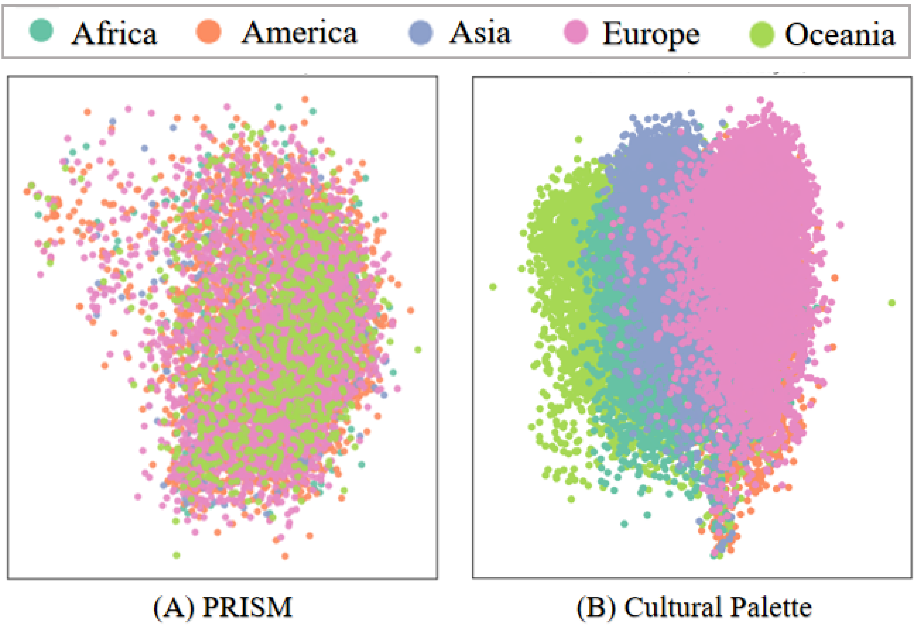

<div align="center">
<h1>
 <strong>Cultural Palette: Pluralising Culture Alignment via Multi-Agent Palette</strong></h1>
<h4 align="center">✨ We introduce <strong>Cultural Palette</strong>: blending cultural colors to create globally aligned AI 🌏</h4>

[](https://arxiv.org/abs/2412.11167)

</div>
<p align="center"> <strong>💌 Contact:</strong> <a href="mailto:jamse_yuan@163.com">jamse_yuan@163.com</a> </p>


<p align="center">

</p>

## 🔥 News
* ```2025.07.29``` 📢 Pentachromatic Cultural Palette Dataset coming soon – stay tuned for release details!
* ```2024.12.15``` 🎉 Cultural Palette released on arxiv, check it now ! (Work in progress)

## 🔍 PCA Semantic Comparison: PRISM vs. Pentachromatic Cultural Palette Dataset

> 📈 Our Pentachromatic Cultural Palette Dataset achieves _clear clustering_ of cultural semantics across five continents **(Africa, America, Asia, Europe, Oceania)**.
<p align="center">

</p>

## 📖 Citation
If you find our work useful for your research, please kindly cite our paper as follows:
```bibtex
@misc{yuan2024culturalpalettepluralisingculture,
      title={Cultural Palette: Pluralising Culture Alignment via Multi-agent Palette}, 
      author={Jiahao Yuan and Zixiang Di and Shangzixin Zhao and Usman Naseem},
      year={2024},
      eprint={2412.11167},
      archivePrefix={arXiv},
      primaryClass={cs.CL},
      url={https://arxiv.org/abs/2412.11167}, 
}
```
## Acknowledge
We gratefully acknowledge [PRISM](https://github.com/HannahKirk/prism-alignment) for invaluable contribution to our dataset.

